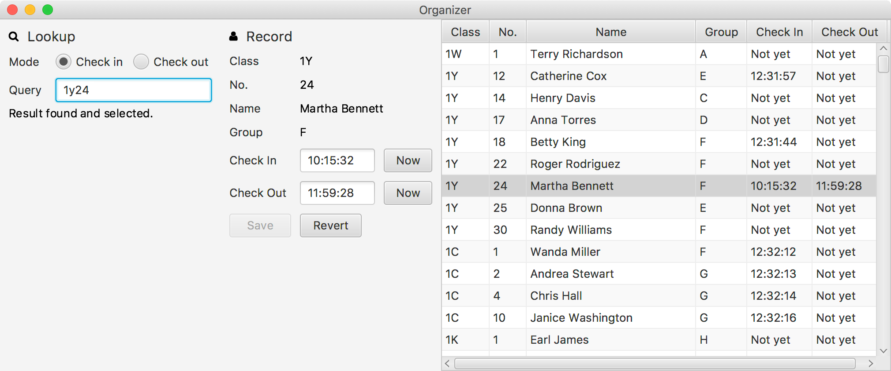

# BazaarOrganizer

Taking records of Bazaar workers' check in/out time. Written in [Kotlin](https://kotlinlang.org/) with [TornadoFX](https://github.com/edvin/tornadofx).

Project created and maintained by [Tiger Tang](https://github.com/TigerHix).
